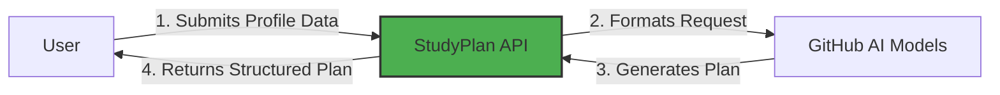
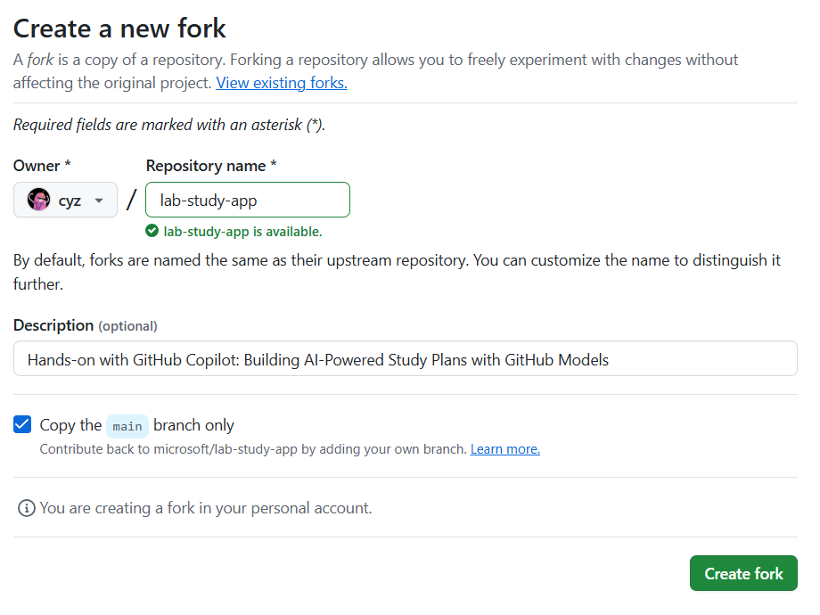
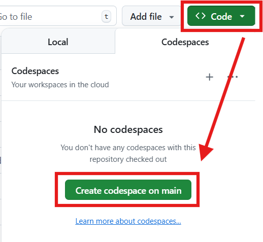
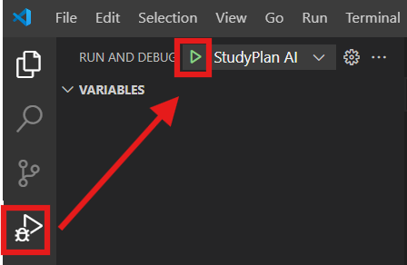
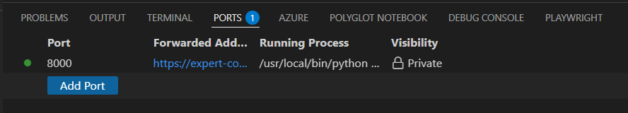
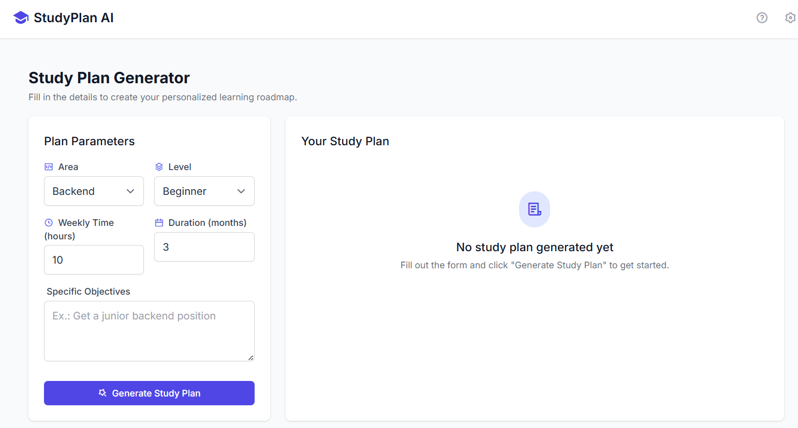

# Step 1: Introduction to StudyPlan App and Environment Setup

> **Summary:**
> In this step, you will set up your Python environment, ensure all dependencies are installed, and understand the architecture of the StudyPlan project.

## What is StudyPlan?

StudyPlan is a web application that leverages artificial intelligence to generate personalized learning paths for technology professionals. The application processes user inputs such as skill level, available study time, and career objectives to create structured, actionable study plans tailored to individual needs.

### Application Flow

The diagram below illustrates the core interaction flow between components:



### Technical Architecture

The application follows a simple, modular architecture:

- **Frontend**: HTML/CSS interface with Tailwind CSS for styling and user interactions
- **Backend**: Python Flask application handling HTTP requests and REST API endpoints
- **AI Integration**: Communication layer with GitHub AI Models for study plan generation
- **Data Flow**: User input is processed through the API layer, sent to AI services, and returned as structured educational content

## ⌨️ Activity: Clone Your Lab Repository

Let's create the repository you'll use for your workshop.

1. Navigate to [the repository root](/)
2. Click on the **Fork** button at the top right of the page to create your own copy of the repository.
3. Under **Owner**, select the name of your GitHub handle.
4. Under **Repository**, set the name to **lab-study-app**.

   <details>
      <summary>📸 Show screenshot</summary>
       
   </details>

5. Click **Create fork**. In a few seconds, a copy of the lab repository will be created under your account.

## ⌨️ Activity: Start the App

> This project uses [Dev Containers](https://code.visualstudio.com/docs/devcontainers/containers), which provide a consistent and reproducible development environment. All required dependencies and configurations come pre-installed, so you can start coding right away. You can run the Dev Container locally in your VS Code, or use [GitHub Codespaces](https://github.com/features/codespaces) — a cloud-powered version of VS Code — to work directly from your browser without needing any setup on your machine.

1. Select **Code** > **Create codespace on main**. In a few moments, your codespace will be created.

   <details>
      <summary>📸 Show screenshot</summary>
       
   </details>

2. Validate the **Copilot Chat** and **Python** extensions are installed and enabled.

3. In your Codespace, open the **Copilot Chat** panel and make sure **Ask** mode is selected. This will allow you to ask Copilot questions about the project.

   > 
   >
   > ```prompt
   > How does the StudyPlan app work?
   > ```

4. Since you're working in a pre-configured environment, most dependencies should already be available. You can verify the essential libraries with:

    ```bash
    # Check if essential libraries are available
    pip list | grep -E "flask|python-dotenv|requests|jinja2|Werkzeug"
    ```

   <details>
      <summary>🖥️ Working locally?</summary>
      
      **For local environment users (Windows):**

      If you're setting up the environment on your local Windows machine, follow these steps:

      ```bash
      # Create a Python virtual environment to isolate dependencies
      python -m venv venv

      # Activate the virtual environment in PowerShell
      .\venv\Scripts\Activate.ps1

      # OR for Windows CMD:
      # venv\Scripts\activate.bat

      # Install all dependencies listed in requirements.txt
      pip install -r requirements.txt
      ```

      **For local environment users (Linux/Mac):**

      If you're setting up the environment on your local Linux/Mac machine, follow these steps:

      ```bash
      python -m venv venv
      source venv/bin/activate
      pip install -r requirements.txt
      ```
   </details>

5. Verify our application runs before modification. In the left sidebar, select the **Run and Debug** tab and then press the **Start Debugging** icon.

   <details>
      <summary>📸 Show screenshot</summary>
       
   </details>

   <details>
      <summary>🤔 How it works?</summary><br/>
   
      The `launch.json` file in the `.vscode` folder defines debugging configurations for VS Code. It allows you to start the application in debug mode with a single click, set breakpoints to examine variables during execution, step through code, and view logs and outputs in real-time. This configuration is already prepared specifically for this Flask project.
   </details>

   <details>
      <summary>🤷 Having trouble?</summary><br/>

    If the **Run and Debug** area is empty, try reloading VS Code: Open the command palette (`Ctrl`+`Shift`+`P`) and search for `Developer: Reload Window`.

   </details>

6. In your **Terminal**, use the **Ports** tab to find the webpage address. You'll see port ``8000`` listed - click the globe icon (🌐) to open the application in your browser or right-click and select "Open in Browser".

     <details>
      <summary>📸 Show screenshot</summary>
       
         
   </details>

> [!TIP]
> Debug mode is a powerful learning tool. You can see exactly what's happening in the code during execution, pause execution at specific points using breakpoints, inspect variable values in real-time, and more easily identify the cause of possible errors.

## ⌨️ Activity: Configure Your GitHub Token

To connect the app with GitHub AI Models, you need to set up a personal access token (PAT). Our application requires authentication to interact with GitHub services securely. The token will enable the StudyPlan AI app to communicate with the AI models that power the study plan generation.

Let's set up your token:

1. **Access**: [GitHub Settings > Personal Access Tokens](https://github.com/settings/tokens)

2. **Create a new classic token** with these settings:
   - Name: `StudyPlan AI Workshop`
   - Expiration: 30 days
   - Scopes: check only `read:user`

3. **Configure the token**: Rename the `.env.example` file to `.env` and add your token inside it.

```
GITHUB_TOKEN=your_token_here
```

The `.env` file is used to store sensitive configuration values, such as access tokens, and should never be hardcoded in the source code. To keep these secrets safe, the `.env` file is already included in `.gitignore`, ensuring it won’t be accidentally committed to the repository.

---

[Next: Check your environment →](02-step.md)
