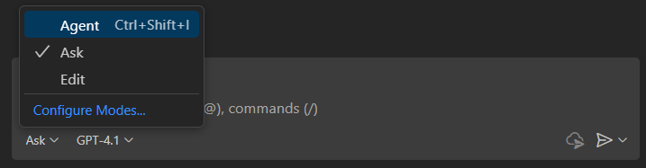

# Step 2: Check your environment

> **Summary:**
> In this step, you'll verify that your environment is set up correctly by running a test script. The script checks your application structure, validates your GitHub token, tests connectivity to the AI service, and confirms that all dependencies are installed.

The `test_setup.py` script is a diagnostic tool that performs a series of checks to ensure your environment is correctly configured. Specifically, it:

* **Checks the application structure**: Confirms that all necessary files are present (e.g., `app/main.py`, `app/services/github_client.py`).
* **Validates the GitHub token**: Looks for the `GITHUB_TOKEN` variable in your `.env` file and ensures it is set.
* **Tests connectivity to the AI service**: Sends a test request to the GitHub AI models service using your token to verify service access and permissions.
* **Confirms dependencies**: Verifies that all required Python libraries are installed.

## ⌨️ Activity: Test Your Configuration

1. Before running the test, you need to implement the `check_dependencies` function to verify all required packages are installed. Open the file `test_setup.py`, then in the **Copilot Chat** panel and select the **Edit** mode.

   <details>
      <summary>📸 Show screenshot</summary>
      
   </details>

2. Ask Copilot to update the function:

  > 
  >
  > ```prompt
  > Update the check_dependencies function to read the packages from requirements.txt and attempt to import each one. Print "✅ Dependencies imported successfully" in the final results list when all dependencies are installed. If any are missing, list the missing packages.
  > ```

3. Review the implementation to ensure it correctly verifies all dependencies from the requirements.txt file.

4. Open your terminal and verify your setup by running:

```bash
python test_setup.py
```

**Expected result:**

```text
✅ Application structure verified
✅ GITHUB_TOKEN found
✅ GitHub Models working - Response: OK  
✅ Dependencies imported successfully
🎉 Setup complete! Everything ready to run the application.
```

<details>
  <summary>🤷 Having trouble?</summary>

1. **GitHub token issues:**

   * Ensure it is copied correctly (no extra spaces)
   * Confirm the `read:user` scope is enabled
   * Use a classic token, not fine-grained

2. **Dependency errors:**

```bash
# Update pip
python -m pip install --upgrade pip

# Reinstall dependencies
pip install -r requirements.txt
```

3. **Python not found locally:**

   * Windows: Install from [python.org](https://python.org)
   * Ensure Python version is 3.9 or higher

</details>

---

| [← Introduction to StudyPlan App and Environment Setup](01-step.md) | [Next: Backend and AI Integration →](03-step.md) |
|:-----------------------------------|------------------------------------------:|
