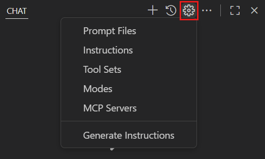
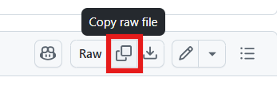
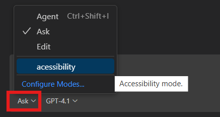

# Step 7: Creating Custom Chat Modes for Accessibility Testing

> **Summary:**
> In this step, you'll learn how to create specialized GitHub Copilot chat modes for accessibility testing. You'll implement a custom assistant that identifies accessibility issues in web applications, suggests improvements based on WCAG standards, and helps integrate accessibility checks into your development workflow. [Explore advanced customization options for GitHub Copilot chat](https://code.visualstudio.com/docs/copilot/customization/overview).

## Understanding Custom Chat Modes

Custom chat modes in GitHub Copilot allow you to tailor the assistant for specialized development tasks. By creating a mode dedicated to accessibility testing, you ensure Copilot focuses exclusively on identifying and resolving accessibility issues in your code.

To build this mode, we'll use the **Awesome GitHub Copilot Customizations** repository—a curated collection of prompts, instructions, and chat modes that extend Copilot across languages, domains, and workflows.

This repository provides three main resources you can use when defining your custom chat mode:

* **[](https://github.com/github/awesome-copilot/blob/main/README.prompts.md)** – Task-specific prompts for generating code, documentation, or solving targeted problems.
* **[](https://github.com/github/awesome-copilot/blob/main/README.instructions.md)** – Project-wide or file-specific coding standards and best practices.
* **[](https://github.com/github/awesome-copilot/blob/main/README.chatmodes.md)** – Ready-to-use personas and conversation modes tailored for different developer roles and contexts.

## ⌨️ Activity: Create a Custom Accessibility Chat Mode

We'll implement the accessibility assistant mode using the [Accessibility mode](https://github.com/github/awesome-copilot/blob/main/chatmodes/accesibility.chatmode.md) from the GitHub repository.

1. **Open Copilot Chat** by clicking the Copilot icon in the VS Code sidebar.

2. In the Copilot Chat panel, select **⚙️ Configure Chat** > **Modes** > **Create new custom chat mode file**. By default, chat mode files are located in the `.github/chatmodes` folder.

   <details>
      <summary>📸 Show screenshot</summary>
       
   </details>

3. Name the chat mode `accessibility`. It will appear in the chat mode dropdown list.
   
4. Once the `accessibility.chatmode.md` file is created, copy its content from the [Accessibility mode repository](https://github.com/github/awesome-copilot/blob/main/chatmodes/accesibility.chatmode.md) using the "Copy raw file" option.

   <details>
      <summary>📸 Show screenshot</summary>
       
   </details>

5. Open the Copilot Chat panel and select `accessibility` from the chat mode dropdown list.

   <details>
      <summary>📸 Show screenshot</summary>
       
   </details>

6. Ask Copilot to check your `index.html` file.

   > 
   >
   > ```prompt
   > Check the accessibility in index.html
   > ```

7. Review the suggestions from the Accessibility chat assistant. Use **Agent mode** to update your `index.html` file and fix any identified accessibility issues.

---

| [← Adding Form Validation](06-step.md) | [Next: Commit and Code Review with GitHub Copilot →](08-step.md) |
|:-----------------------------------|------------------------------------------:|
