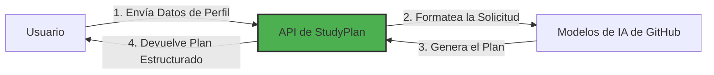

# Paso 1: Introducción a la Aplicación StudyPlan y Configuración del Entorno

> **Resumen:**
> En este paso, configurarás tu entorno Python, asegurarás que todas las dependencias estén instaladas y comprenderás la arquitectura del proyecto StudyPlan.

## ¿Qué es StudyPlan?

StudyPlan es una aplicación web que utiliza inteligencia artificial para generar rutas de aprendizaje personalizadas para profesionales de tecnología. La aplicación procesa las entradas del usuario, como nivel de habilidad, tiempo de estudio disponible y objetivos profesionales, para crear planes de estudio estructurados y accionables adaptados a las necesidades individuales.

### Flujo de la Aplicación

El diagrama a continuación ilustra el flujo de interacción principal entre los componentes:

### Arquitectura Técnica

La aplicación sigue una arquitectura simple y modular:

- **Frontend**: Interfaz HTML/CSS con Tailwind CSS para estilización e interacciones del usuario
- **Backend**: Aplicación Python Flask que maneja solicitudes HTTP y endpoints de API REST
- **Integración con IA**: Capa de comunicación con los Modelos de IA de GitHub para la generación de planes de estudio
- **Flujo de Datos**: La entrada del usuario se procesa a través de la capa de API, se envía a los servicios de IA y se devuelve como contenido educativo estructurado

## ⌨️ Actividad: Clonar tu Repositorio de Laboratorio

Vamos a crear el repositorio que utilizarás para tu taller.

1. Navega hasta [la raíz del repositorio](/)
2. Haz clic en el botón **Fork** en la parte superior derecha de la página para crear tu propia copia del repositorio.
3. En **Owner**, selecciona el nombre de tu perfil de GitHub.
4. En **Repository**, establece el nombre como **lab-study-app**.

   

      
📸 Mostrar captura de pantalla

       
   

5. Haz clic en **Create fork**. En unos segundos, se creará una copia del repositorio de laboratorio en tu cuenta.

## ⌨️ Actividad: Iniciar la Aplicación

> Este proyecto utiliza [Dev Containers](https://code.visualstudio.com/docs/devcontainers/containers), que proporcionan un entorno de desarrollo consistente y reproducible. Todas las dependencias y configuraciones necesarias vienen preinstaladas, para que puedas comenzar a programar de inmediato. Puedes ejecutar el Dev Container localmente en tu VS Code o usar [GitHub Codespaces](https://github.com/features/codespaces) — una versión de VS Code basada en la nube — para trabajar directamente desde tu navegador sin necesidad de ninguna configuración en tu máquina.
