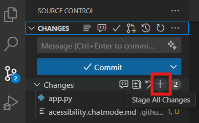
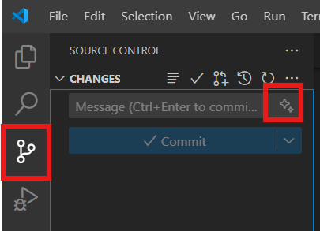
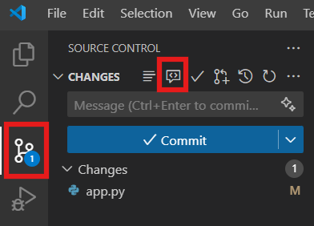

# Paso 8: Commit y Revisión de Código con GitHub Copilot

> **Resumen:**
> En este paso, aprenderás cómo usar GitHub Copilot para generar automáticamente mensajes de commit significativos basados en tus cambios de código y para realizar revisiones de código antes de hacer commit. Estas características ayudan a mejorar tu flujo de trabajo con Git y mantener una alta calidad de código.

## ⌨️ Actividad: Generando un Mensaje de Commit

Usemos GitHub Copilot para generar un mensaje de commit para las mejoras de accesibilidad que has realizado:

1. **Abre la vista de Control de Código Fuente** en VS Code haciendo clic en el icono de Git o presionando `Ctrl+Shift+G` (`Cmd+Shift+G` en macOS).

2. Prepara tus cambios haciendo clic en el icono `+` junto a los archivos modificados o usando la opción "Stage All Changes" (Preparar Todos los Cambios).

   <details>
      <summary>📸 Mostrar captura de pantalla</summary>
       
   </details>
   
3. **Haz clic en el icono de GitHub Copilot** en el área de entrada del mensaje de commit (parece un icono de brillo o IA).

   <details>
      <summary>📸 Mostrar captura de pantalla</summary>
       
   </details>

4. **Espera a que Copilot analice tus cambios** y genere un mensaje de commit automáticamente. El mensaje aparecerá en el campo de entrada del commit.

5. **Revisa y edita** el mensaje generado si es necesario. Incluso con asistencia de IA, es una buena práctica verificar que el mensaje refleje con precisión tus cambios.

6. **Completa el commit** haciendo clic en el icono de marca de verificación o presionando `Ctrl+Enter` (`Cmd+Enter` en macOS).

<details>
  <summary>Ejemplo de un mensaje de commit generado</summary>

```
Mejorar accesibilidad en el panel de StudyPlan AI

- Añadir puntos de referencia semánticos HTML5 (header, nav, main, footer)
- Hacer todos los elementos interactivos accesibles por teclado
- Añadir atributos ARIA adecuados a iconos y componentes de UI
- Mejorar el etiquetado y asociaciones de campos de formulario
- Añadir anuncios de mensajes de estado para lectores de pantalla

Estos cambios aseguran el cumplimiento de WCAG 2.1 AA y mejoran la experiencia para usuarios con discapacidades.
```

</details>

## ⌨️ Actividad: Realizando Revisiones de Código con Copilot

Antes de finalizar tu commit, usa GitHub Copilot para revisar tus cambios de código:

1. **Abre la Paleta de Comandos** con `Ctrl+Shift+P` (`Cmd+Shift+P` en macOS).

2. **Busca "GitHub Copilot: Review Changes"** (Revisar Cambios) y selecciónalo.

3. **Espera a que Copilot analice tus cambios** y proporcione retroalimentación sobre posibles problemas o mejoras.

   <details>
      <summary>📸 Mostrar captura de pantalla</summary>
       
   </details>

4. Revisa las sugerencias proporcionadas por Copilot, que pueden incluir posibles errores o fallos lógicos, problemas de accesibilidad, optimizaciones de rendimiento, vulnerabilidades de seguridad y mejoras en el estilo de código.

5. Aborda cualquier sugerencia relevante antes de proceder con tu commit.

6. Genera un nuevo mensaje de commit que refleje cualquier mejora adicional que hayas realizado.


## 💡 Mejores Prácticas para Usar Estas Características

1. **Siempre revisa los mensajes de commit generados** antes de hacer commit para asegurar la precisión.

2. **Añade contexto cuando sea necesario** - La IA puede no entender el "por qué" detrás de ciertos cambios.

3. **Considera la revisión de código de Copilot como una herramienta complementaria** - no reemplaza la revisión de código humana.

4. **Combina con verificaciones de accesibilidad** del paso anterior para una garantía de calidad integral.

5. **Usa estas características consistentemente** para construir buenos hábitos de desarrollo.

---

| [← Creando Modos de Chat Personalizados para Pruebas de Accesibilidad](07-step.md) | [Siguiente: Revisión y siguientes pasos →](09-step.md) |
|:-----------------------------------|------------------------------------------:|
