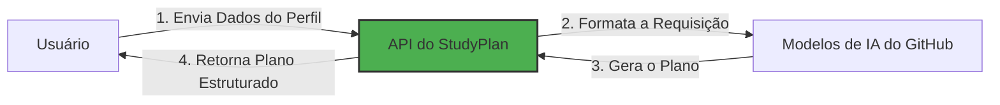

# Passo 1: Introdução ao Aplicativo StudyPlan e Configuração do Ambiente

> **Resumo:**
> Neste passo, você configurará seu ambiente Python, garantirá que todas as dependências estejam instaladas e entenderá a arquitetura do projeto StudyPlan.

## O que é o StudyPlan?

StudyPlan é uma aplicação web que utiliza inteligência artificial para gerar percursos de aprendizagem personalizados para profissionais de tecnologia. A aplicação processa as informações do usuário, como nível de habilidade, tempo de estudo disponível e objetivos de carreira, para criar planos de estudo estruturados e acionáveis, adaptados às necessidades individuais.

### Fluxo da Aplicação

O diagrama abaixo ilustra o fluxo de interação principal entre os componentes:

### Arquitetura Técnica

A aplicação segue uma arquitetura simples e modular:

- **Frontend**: Interface HTML/CSS com Tailwind CSS para estilização e interações do usuário
- **Backend**: Aplicação Python Flask lidando com requisições HTTP e endpoints de API REST
- **Integração com IA**: Camada de comunicação com os Modelos de IA do GitHub para geração de planos de estudo
- **Fluxo de Dados**: A entrada do usuário é processada através da camada de API, enviada para os serviços de IA e retornada como conteúdo educacional estruturado

## ⌨️ Atividade: Clone seu Repositório de Laboratório

Vamos criar o repositório que você usará para seu workshop.

1. Navegue até [a raiz do repositório](/)
2. Clique no botão **Fork** no canto superior direito da página para criar sua própria cópia do repositório.
3. Em **Owner**, selecione o nome do seu perfil GitHub.
4. Em **Repository**, defina o nome como **lab-study-app**.

   

      
📸 Mostrar captura de tela

       
   

5. Clique em **Create fork**. Em alguns segundos, uma cópia do repositório de laboratório será criada em sua conta.

## ⌨️ Atividade: Inicie o Aplicativo

> Este projeto utiliza [Dev Containers](https://code.visualstudio.com/docs/devcontainers/containers), que fornecem um ambiente de desenvolvimento consistente e reproduzível. Todas as dependências e configurações necessárias vêm pré-instaladas, para que você possa começar a programar imediatamente. Você pode executar o Dev Container localmente no seu VS Code ou usar [GitHub Codespaces](https://github.com/features/codespaces) — uma versão do VS Code baseada na nuvem — para trabalhar diretamente do seu navegador sem precisar de qualquer configuração em sua máquina.
